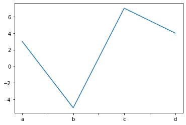
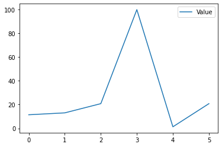

#  Utilizando las hojas de trucos de Pandas, complete cada uno de los ejercicios 


##### La biblioteca de Pandas se basa en NumPy y proporciona estructuras de datos y herramientas de análisis de datos para Python lenguaje de programación.


```python
# importamos panda
import numpy as np
import pandas as pd
#declaramos el arreglo que estaremos utilizando
s = pd.Series([3, -5, 7, 4], index=['a', 'b', 'c', 'd'])
df = pd.DataFrame(data, 
 columns=['Country', 'Capital', 'Population'])
print(s)
print(df)
```

    a    3
    b   -5
    c    7
    d    4
    dtype: int64
       Country    Capital  Population
    0  Belgium   Brussels    11190846
    1    India  New Delhi  1303171035
    2   Brazil   Brasília   207847528
    


```python
 data = {'Country': ['Belgium', 'India', 'Brazil'], 
 'Capital': ['Brussels', 'New Delhi', 'Brasília'],
 'Population': [11190846, 1303171035, 207847528]}
```


```python
#leemos el fichero en tipo csv
#pd.read_csv('file.csv', header=None, nrows=5)
#df.to_csv('myDataFrame.csv')
pd.read_csv('datos_rrss_t1.csv')
```


<div>
<style scoped>
    .dataframe tbody tr th:only-of-type {
        vertical-align: middle;
    }

    .dataframe tbody tr th {
        vertical-align: top;
    }

    .dataframe thead th {
        text-align: right;
    }
</style>
<table border="1" class="dataframe">
  <thead>
    <tr style="text-align: right;">
      <th></th>
      <th>Nombre</th>
      <th>Cantidad</th>
      <th>ES_FBK</th>
      <th>Anio</th>
    </tr>
  </thead>
  <tbody>
    <tr>
      <th>0</th>
      <td>Facebook</td>
      <td>2449</td>
      <td>VERDADERO</td>
      <td>2006</td>
    </tr>
    <tr>
      <th>1</th>
      <td>Twitter</td>
      <td>339</td>
      <td>FALSO</td>
      <td>2006</td>
    </tr>
    <tr>
      <th>2</th>
      <td>Instagram</td>
      <td>1000</td>
      <td>VERDADERO</td>
      <td>2010</td>
    </tr>
    <tr>
      <th>3</th>
      <td>YouTube</td>
      <td>2000</td>
      <td>FALSO</td>
      <td>2005</td>
    </tr>
    <tr>
      <th>4</th>
      <td>LinkedIn</td>
      <td>663</td>
      <td>FALSO</td>
      <td>2003</td>
    </tr>
    <tr>
      <th>5</th>
      <td>WhatsApp</td>
      <td>1600</td>
      <td>VERDADERO</td>
      <td>2009</td>
    </tr>
  </tbody>
</table>
</div>


```python
path = 'datos_rrss.xlsx'
```


```python
#Leer y escribir en Excel
pd.read_excel('datos_rrss.xlsx')
#pd.to_excel('dir/myDataFrame.xlsx', sheet_name='Sheet1')
```


<div>
<style scoped>
    .dataframe tbody tr th:only-of-type {
        vertical-align: middle;
    }

    .dataframe tbody tr th {
        vertical-align: top;
    }

    .dataframe thead th {
        text-align: right;
    }
</style>
<table border="1" class="dataframe">
  <thead>
    <tr style="text-align: right;">
      <th></th>
      <th>Nombre</th>
      <th>Cantidad</th>
      <th>ES_FBK</th>
      <th>Año</th>
    </tr>
  </thead>
  <tbody>
    <tr>
      <th>0</th>
      <td>Facebook</td>
      <td>2449</td>
      <td>True</td>
      <td>2006</td>
    </tr>
    <tr>
      <th>1</th>
      <td>Twitter</td>
      <td>339</td>
      <td>False</td>
      <td>2006</td>
    </tr>
    <tr>
      <th>2</th>
      <td>Instagram</td>
      <td>1000</td>
      <td>True</td>
      <td>2010</td>
    </tr>
    <tr>
      <th>3</th>
      <td>YouTube</td>
      <td>2000</td>
      <td>False</td>
      <td>2005</td>
    </tr>
    <tr>
      <th>4</th>
      <td>LinkedIn</td>
      <td>663</td>
      <td>False</td>
      <td>2003</td>
    </tr>
    <tr>
      <th>5</th>
      <td>WhatsApp</td>
      <td>1600</td>
      <td>True</td>
      <td>2009</td>
    </tr>
  </tbody>
</table>
</div>


```python
#Leer varias hojas del mismo archivo
#xlsx = pd.ExcelFile('datos_rrss.xlsx')
#df = pd.read_excel(sheet_name='hoja2')
pd.read_excel('datos_rrss.xlsx',
             sheet_name='Hoja2')
```


<div>
<style scoped>
    .dataframe tbody tr th:only-of-type {
        vertical-align: middle;
    }

    .dataframe tbody tr th {
        vertical-align: top;
    }

    .dataframe thead th {
        text-align: right;
    }
</style>
<table border="1" class="dataframe">
  <thead>
    <tr style="text-align: right;">
      <th></th>
      <th>Nombre</th>
      <th>Cantidad</th>
      <th>ES_FBK</th>
      <th>Año</th>
    </tr>
  </thead>
  <tbody>
    <tr>
      <th>0</th>
      <td>Facebook</td>
      <td>2449</td>
      <td>True</td>
      <td>2006</td>
    </tr>
    <tr>
      <th>1</th>
      <td>Twitter</td>
      <td>339</td>
      <td>False</td>
      <td>2006</td>
    </tr>
    <tr>
      <th>2</th>
      <td>Instagram</td>
      <td>1000</td>
      <td>True</td>
      <td>2010</td>
    </tr>
  </tbody>
</table>
</div>


```python
#usamos documentacion de ayuda
help(pd.Series.loc)
```

    Help on property:
    
        Access a group of rows and columns by label(s) or a boolean array.
        
        ``.loc[]`` is primarily label based, but may also be used with a
        boolean array.
        
        Allowed inputs are:
        
        - A single label, e.g. ``5`` or ``'a'``, (note that ``5`` is
          interpreted as a *label* of the index, and **never** as an
          integer position along the index).
        - A list or array of labels, e.g. ``['a', 'b', 'c']``.
        - A slice object with labels, e.g. ``'a':'f'``.
        
          .. warning:: Note that contrary to usual python slices, **both** the
              start and the stop are included
        
        - A boolean array of the same length as the axis being sliced,
          e.g. ``[True, False, True]``.
        - An alignable boolean Series. The index of the key will be aligned before
          masking.
        - An alignable Index. The Index of the returned selection will be the input.
        - A ``callable`` function with one argument (the calling Series or
          DataFrame) and that returns valid output for indexing (one of the above)
        
        See more at :ref:`Selection by Label <indexing.label>`.
        
        Raises
        ------
        KeyError
            If any items are not found.
        IndexingError
            If an indexed key is passed and its index is unalignable to the frame index.
        
        See Also
        --------
        DataFrame.at : Access a single value for a row/column label pair.
        DataFrame.iloc : Access group of rows and columns by integer position(s).
        DataFrame.xs : Returns a cross-section (row(s) or column(s)) from the
            Series/DataFrame.
        Series.loc : Access group of values using labels.
        
        Examples
        --------
        **Getting values**
        
        >>> df = pd.DataFrame([[1, 2], [4, 5], [7, 8]],
        ...      index=['cobra', 'viper', 'sidewinder'],
        ...      columns=['max_speed', 'shield'])
        >>> df
                    max_speed  shield
        cobra               1       2
        viper               4       5
        sidewinder          7       8
        
        Single label. Note this returns the row as a Series.
        
        >>> df.loc['viper']
        max_speed    4
        shield       5
        Name: viper, dtype: int64
        
        List of labels. Note using ``[[]]`` returns a DataFrame.
        
        >>> df.loc[['viper', 'sidewinder']]
                    max_speed  shield
        viper               4       5
        sidewinder          7       8
        
        Single label for row and column
        
        >>> df.loc['cobra', 'shield']
        2
        
        Slice with labels for row and single label for column. As mentioned
        above, note that both the start and stop of the slice are included.
        
        >>> df.loc['cobra':'viper', 'max_speed']
        cobra    1
        viper    4
        Name: max_speed, dtype: int64
        
        Boolean list with the same length as the row axis
        
        >>> df.loc[[False, False, True]]
                    max_speed  shield
        sidewinder          7       8
        
        Alignable boolean Series:
        
        >>> df.loc[pd.Series([False, True, False],
        ...        index=['viper', 'sidewinder', 'cobra'])]
                    max_speed  shield
        sidewinder          7       8
        
        Index (same behavior as ``df.reindex``)
        
        >>> df.loc[pd.Index(["cobra", "viper"], name="foo")]
               max_speed  shield
        foo
        cobra          1       2
        viper          4       5
        
        Conditional that returns a boolean Series
        
        >>> df.loc[df['shield'] > 6]
                    max_speed  shield
        sidewinder          7       8
        
        Conditional that returns a boolean Series with column labels specified
        
        >>> df.loc[df['shield'] > 6, ['max_speed']]
                    max_speed
        sidewinder          7
        
        Callable that returns a boolean Series
        
        >>> df.loc[lambda df: df['shield'] == 8]
                    max_speed  shield
        sidewinder          7       8
        
        **Setting values**
        
        Set value for all items matching the list of labels
        
        >>> df.loc[['viper', 'sidewinder'], ['shield']] = 50
        >>> df
                    max_speed  shield
        cobra               1       2
        viper               4      50
        sidewinder          7      50
        
        Set value for an entire row
        
        >>> df.loc['cobra'] = 10
        >>> df
                    max_speed  shield
        cobra              10      10
        viper               4      50
        sidewinder          7      50
        
        Set value for an entire column
        
        >>> df.loc[:, 'max_speed'] = 30
        >>> df
                    max_speed  shield
        cobra              30      10
        viper              30      50
        sidewinder         30      50
        
        Set value for rows matching callable condition
        
        >>> df.loc[df['shield'] > 35] = 0
        >>> df
                    max_speed  shield
        cobra              30      10
        viper               0       0
        sidewinder          0       0
        
        **Getting values on a DataFrame with an index that has integer labels**
        
        Another example using integers for the index
        
        >>> df = pd.DataFrame([[1, 2], [4, 5], [7, 8]],
        ...      index=[7, 8, 9], columns=['max_speed', 'shield'])
        >>> df
           max_speed  shield
        7          1       2
        8          4       5
        9          7       8
        
        Slice with integer labels for rows. As mentioned above, note that both
        the start and stop of the slice are included.
        
        >>> df.loc[7:9]
           max_speed  shield
        7          1       2
        8          4       5
        9          7       8
        
        **Getting values with a MultiIndex**
        
        A number of examples using a DataFrame with a MultiIndex
        
        >>> tuples = [
        ...    ('cobra', 'mark i'), ('cobra', 'mark ii'),
        ...    ('sidewinder', 'mark i'), ('sidewinder', 'mark ii'),
        ...    ('viper', 'mark ii'), ('viper', 'mark iii')
        ... ]
        >>> index = pd.MultiIndex.from_tuples(tuples)
        >>> values = [[12, 2], [0, 4], [10, 20],
        ...         [1, 4], [7, 1], [16, 36]]
        >>> df = pd.DataFrame(values, columns=['max_speed', 'shield'], index=index)
        >>> df
                             max_speed  shield
        cobra      mark i           12       2
                   mark ii           0       4
        sidewinder mark i           10      20
                   mark ii           1       4
        viper      mark ii           7       1
                   mark iii         16      36
        
        Single label. Note this returns a DataFrame with a single index.
        
        >>> df.loc['cobra']
                 max_speed  shield
        mark i          12       2
        mark ii          0       4
        
        Single index tuple. Note this returns a Series.
        
        >>> df.loc[('cobra', 'mark ii')]
        max_speed    0
        shield       4
        Name: (cobra, mark ii), dtype: int64
        
        Single label for row and column. Similar to passing in a tuple, this
        returns a Series.
        
        >>> df.loc['cobra', 'mark i']
        max_speed    12
        shield        2
        Name: (cobra, mark i), dtype: int64
        
        Single tuple. Note using ``[[]]`` returns a DataFrame.
        
        >>> df.loc[[('cobra', 'mark ii')]]
                       max_speed  shield
        cobra mark ii          0       4
        
        Single tuple for the index with a single label for the column
        
        >>> df.loc[('cobra', 'mark i'), 'shield']
        2
        
        Slice from index tuple to single label
        
        >>> df.loc[('cobra', 'mark i'):'viper']
                             max_speed  shield
        cobra      mark i           12       2
                   mark ii           0       4
        sidewinder mark i           10      20
                   mark ii           1       4
        viper      mark ii           7       1
                   mark iii         16      36
        
        Slice from index tuple to index tuple
        
        >>> df.loc[('cobra', 'mark i'):('viper', 'mark ii')]
                            max_speed  shield
        cobra      mark i          12       2
                   mark ii          0       4
        sidewinder mark i          10      20
                   mark ii          1       4
        viper      mark ii          7       1
    
    


```python
#usamos la seleccion de un elemento 
s['b'] 
```


    -5


```python
# Obtener un subconjunto de un DataFrame
df[1:]
```


<div>
<style scoped>
    .dataframe tbody tr th:only-of-type {
        vertical-align: middle;
    }

    .dataframe tbody tr th {
        vertical-align: top;
    }

    .dataframe thead th {
        text-align: right;
    }
</style>
<table border="1" class="dataframe">
  <thead>
    <tr style="text-align: right;">
      <th></th>
      <th>Country</th>
      <th>Capital</th>
      <th>Population</th>
    </tr>
  </thead>
  <tbody>
    <tr>
      <th>1</th>
      <td>India</td>
      <td>New Delhi</td>
      <td>1303171035</td>
    </tr>
    <tr>
      <th>2</th>
      <td>Brazil</td>
      <td>Brasília</td>
      <td>207847528</td>
    </tr>
  </tbody>
</table>
</div>


# Selección, indexación booleana y configuración


```python
# Seleccione un solo valor por fila y columna
df.iloc[0]
df.iloc[0,0] 
```


    'Belgium'


```python
df.iat[0,0]
```


    'Belgium'


# Por etiqueta


```python
df.loc[0, 'Country']
```


    'Belgium'


```python
df.at[0, 'Country'] 
```


    'Belgium'


# Por etiqueta / posición


```python
#df.ix[2] Seleccione una sola fila del subconjunto de filas de País Brasil
df.loc[2]
```


    Country          Brazil
    Capital        Brasília
    Population    207847528
    Name: 2, dtype: object


```python
#df.ix[:,'Capital'] elegir una sola columna de 0 subconjunto de columnas de Bruselas
df.loc[:,'Capital'] 
```


    0     Brussels
    1    New Delhi
    2     Brasília
    Name: Capital, dtype: object


```python
# df.ix[1,'Capital'] 
df.loc[1,'Capital'] 
```


    'New Delhi'


# Indexación booleana
Serie s donde el valor no es> 1
 s donde el valor es <-1 o> 2
 Utilice el filtro para ajustar DataFrame


```python
s[~(s > 1)] 
```


    b   -5
    dtype: int64


```python
s[(s < -1) | (s > 2)] 
```


    a    3
    b   -5
    c    7
    d    4
    dtype: int64


```python
 df[df['Population']>1200000000]
```


<div>
<style scoped>
    .dataframe tbody tr th:only-of-type {
        vertical-align: middle;
    }

    .dataframe tbody tr th {
        vertical-align: top;
    }

    .dataframe thead th {
        text-align: right;
    }
</style>
<table border="1" class="dataframe">
  <thead>
    <tr style="text-align: right;">
      <th></th>
      <th>Country</th>
      <th>Capital</th>
      <th>Population</th>
    </tr>
  </thead>
  <tbody>
    <tr>
      <th>1</th>
      <td>India</td>
      <td>New Delhi</td>
      <td>1303171035</td>
    </tr>
  </tbody>
</table>
</div>


# Configuración


```python
s['a'] = 6 
```

# Leer y escribir en una tabla de base de datos o consulta SQL


```python
from sqlalchemy import create_engine
```


```python
 engine = create_engine('sqlite:///:memory:')
```


```python
# pd.read_sql("SELECT * FROM my_table;", engine)
```


```python
#pd.read_sql_table('my_table', engine)
```


```python
# pd.read_sql_query("SELECT * FROM my_table;", engine)
```


```python
#pd.to_sql('myDf', engine)
```

# Goteante


```python
s.drop(['a', 'c']) #Eliminar valores de filas (eje = 0)
```


    b   -5
    d    4
    dtype: int64


```python
df.drop('Country', axis=1) #Eliminar valores de columnas (eje = 1)
```


<div>
<style scoped>
    .dataframe tbody tr th:only-of-type {
        vertical-align: middle;
    }

    .dataframe tbody tr th {
        vertical-align: top;
    }

    .dataframe thead th {
        text-align: right;
    }
</style>
<table border="1" class="dataframe">
  <thead>
    <tr style="text-align: right;">
      <th></th>
      <th>Capital</th>
      <th>Population</th>
    </tr>
  </thead>
  <tbody>
    <tr>
      <th>0</th>
      <td>Brussels</td>
      <td>11190846</td>
    </tr>
    <tr>
      <th>1</th>
      <td>New Delhi</td>
      <td>1303171035</td>
    </tr>
    <tr>
      <th>2</th>
      <td>Brasília</td>
      <td>207847528</td>
    </tr>
  </tbody>
</table>
</div>


# Ordenar y clasificar


```python
df.sort_index() # Ordenar por etiquetas a lo largo de un eje
```


<div>
<style scoped>
    .dataframe tbody tr th:only-of-type {
        vertical-align: middle;
    }

    .dataframe tbody tr th {
        vertical-align: top;
    }

    .dataframe thead th {
        text-align: right;
    }
</style>
<table border="1" class="dataframe">
  <thead>
    <tr style="text-align: right;">
      <th></th>
      <th>Country</th>
      <th>Capital</th>
      <th>Population</th>
    </tr>
  </thead>
  <tbody>
    <tr>
      <th>0</th>
      <td>Belgium</td>
      <td>Brussels</td>
      <td>11190846</td>
    </tr>
    <tr>
      <th>1</th>
      <td>India</td>
      <td>New Delhi</td>
      <td>1303171035</td>
    </tr>
    <tr>
      <th>2</th>
      <td>Brazil</td>
      <td>Brasília</td>
      <td>207847528</td>
    </tr>
  </tbody>
</table>
</div>


```python
df.sort_values(by='Country')  #Ordenar por los valores a lo largo de un eje
```


<div>
<style scoped>
    .dataframe tbody tr th:only-of-type {
        vertical-align: middle;
    }

    .dataframe tbody tr th {
        vertical-align: top;
    }

    .dataframe thead th {
        text-align: right;
    }
</style>
<table border="1" class="dataframe">
  <thead>
    <tr style="text-align: right;">
      <th></th>
      <th>Country</th>
      <th>Capital</th>
      <th>Population</th>
    </tr>
  </thead>
  <tbody>
    <tr>
      <th>0</th>
      <td>Belgium</td>
      <td>Brussels</td>
      <td>11190846</td>
    </tr>
    <tr>
      <th>2</th>
      <td>Brazil</td>
      <td>Brasília</td>
      <td>207847528</td>
    </tr>
    <tr>
      <th>1</th>
      <td>India</td>
      <td>New Delhi</td>
      <td>1303171035</td>
    </tr>
  </tbody>
</table>
</div>


```python
df.rank() #Asignar rangos a las entradas
```


<div>
<style scoped>
    .dataframe tbody tr th:only-of-type {
        vertical-align: middle;
    }

    .dataframe tbody tr th {
        vertical-align: top;
    }

    .dataframe thead th {
        text-align: right;
    }
</style>
<table border="1" class="dataframe">
  <thead>
    <tr style="text-align: right;">
      <th></th>
      <th>Country</th>
      <th>Capital</th>
      <th>Population</th>
    </tr>
  </thead>
  <tbody>
    <tr>
      <th>0</th>
      <td>1.0</td>
      <td>2.0</td>
      <td>1.0</td>
    </tr>
    <tr>
      <th>1</th>
      <td>3.0</td>
      <td>3.0</td>
      <td>3.0</td>
    </tr>
    <tr>
      <th>2</th>
      <td>2.0</td>
      <td>1.0</td>
      <td>2.0</td>
    </tr>
  </tbody>
</table>
</div>


# Recuperación de información de series / marcos de datos

### Basic Information


```python
 df.shape #(filas, columnas)
```


    (3, 3)


```python
 df.index #Describe el índice
```


    RangeIndex(start=0, stop=3, step=1)


```python
df.columns # Describir columnas de DataFrame
```


    Index(['Country', 'Capital', 'Population'], dtype='object')


```python
df.info() #Información sobre DataFrame

```

    <class 'pandas.core.frame.DataFrame'>
    RangeIndex: 3 entries, 0 to 2
    Data columns (total 3 columns):
     #   Column      Non-Null Count  Dtype 
    ---  ------      --------------  ----- 
     0   Country     3 non-null      object
     1   Capital     3 non-null      object
     2   Population  3 non-null      int64 
    dtypes: int64(1), object(2)
    memory usage: 200.0+ bytes
    

# Resumen


```python
df.sum()  #Suma de valores
```


    Country              BelgiumIndiaBrazil
    Capital       BrusselsNew DelhiBrasília
    Population                   1522209409
    dtype: object


```python
df.cumsum() #Suma acumulativa de valores
```


<div>
<style scoped>
    .dataframe tbody tr th:only-of-type {
        vertical-align: middle;
    }

    .dataframe tbody tr th {
        vertical-align: top;
    }

    .dataframe thead th {
        text-align: right;
    }
</style>
<table border="1" class="dataframe">
  <thead>
    <tr style="text-align: right;">
      <th></th>
      <th>Country</th>
      <th>Capital</th>
      <th>Population</th>
    </tr>
  </thead>
  <tbody>
    <tr>
      <th>0</th>
      <td>Belgium</td>
      <td>Brussels</td>
      <td>11190846</td>
    </tr>
    <tr>
      <th>1</th>
      <td>BelgiumIndia</td>
      <td>BrusselsNew Delhi</td>
      <td>1314361881</td>
    </tr>
    <tr>
      <th>2</th>
      <td>BelgiumIndiaBrazil</td>
      <td>BrusselsNew DelhiBrasília</td>
      <td>1522209409</td>
    </tr>
  </tbody>
</table>
</div>


```python
df.min()#Valores mínimos / máximos

```


    Country        Belgium
    Capital       Brasília
    Population    11190846
    dtype: object


```python
df.max()
```


    Country            India
    Capital        New Delhi
    Population    1303171035
    dtype: object


```python
df.describe() #Resumen estadístico

```


<div>
<style scoped>
    .dataframe tbody tr th:only-of-type {
        vertical-align: middle;
    }

    .dataframe tbody tr th {
        vertical-align: top;
    }

    .dataframe thead th {
        text-align: right;
    }
</style>
<table border="1" class="dataframe">
  <thead>
    <tr style="text-align: right;">
      <th></th>
      <th>Population</th>
    </tr>
  </thead>
  <tbody>
    <tr>
      <th>count</th>
      <td>3.000000e+00</td>
    </tr>
    <tr>
      <th>mean</th>
      <td>5.074031e+08</td>
    </tr>
    <tr>
      <th>std</th>
      <td>6.961346e+08</td>
    </tr>
    <tr>
      <th>min</th>
      <td>1.119085e+07</td>
    </tr>
    <tr>
      <th>25%</th>
      <td>1.095192e+08</td>
    </tr>
    <tr>
      <th>50%</th>
      <td>2.078475e+08</td>
    </tr>
    <tr>
      <th>75%</th>
      <td>7.555093e+08</td>
    </tr>
    <tr>
      <th>max</th>
      <td>1.303171e+09</td>
    </tr>
  </tbody>
</table>
</div>


```python
 df.mean() #Media de valores
```


    Population    5.074031e+08
    dtype: float64


```python
df.median() #mediana de valores
```


    Population    207847528.0
    dtype: float64


# Aplicar funciones


```python
f = lambda x: x*2
```


```python
df.apply(f) #Aplicar función
```


<div>
<style scoped>
    .dataframe tbody tr th:only-of-type {
        vertical-align: middle;
    }

    .dataframe tbody tr th {
        vertical-align: top;
    }

    .dataframe thead th {
        text-align: right;
    }
</style>
<table border="1" class="dataframe">
  <thead>
    <tr style="text-align: right;">
      <th></th>
      <th>Country</th>
      <th>Capital</th>
      <th>Population</th>
    </tr>
  </thead>
  <tbody>
    <tr>
      <th>0</th>
      <td>BelgiumBelgium</td>
      <td>BrusselsBrussels</td>
      <td>22381692</td>
    </tr>
    <tr>
      <th>1</th>
      <td>IndiaIndia</td>
      <td>New DelhiNew Delhi</td>
      <td>2606342070</td>
    </tr>
    <tr>
      <th>2</th>
      <td>BrazilBrazil</td>
      <td>BrasíliaBrasília</td>
      <td>415695056</td>
    </tr>
  </tbody>
</table>
</div>


```python
df.applymap(f) #Aplicar la función por elementos
```


<div>
<style scoped>
    .dataframe tbody tr th:only-of-type {
        vertical-align: middle;
    }

    .dataframe tbody tr th {
        vertical-align: top;
    }

    .dataframe thead th {
        text-align: right;
    }
</style>
<table border="1" class="dataframe">
  <thead>
    <tr style="text-align: right;">
      <th></th>
      <th>Country</th>
      <th>Capital</th>
      <th>Population</th>
    </tr>
  </thead>
  <tbody>
    <tr>
      <th>0</th>
      <td>BelgiumBelgium</td>
      <td>BrusselsBrussels</td>
      <td>22381692</td>
    </tr>
    <tr>
      <th>1</th>
      <td>IndiaIndia</td>
      <td>New DelhiNew Delhi</td>
      <td>2606342070</td>
    </tr>
    <tr>
      <th>2</th>
      <td>BrazilBrazil</td>
      <td>BrasíliaBrasília</td>
      <td>415695056</td>
    </tr>
  </tbody>
</table>
</div>


# Alineación de datos

Alineación de datos internos


```python
s3 = pd.Series([7, -2, 3], index=['a', 'c', 'd']) #Los valores NA se introducen en los índices que no se superponen:
s + s3
```


    a    13.0
    b     NaN
    c     5.0
    d     7.0
    dtype: float64


###### Operaciones aritméticas con métodos de relleno

También puede realizar la alineación de datos internos usted mismo con
la ayuda de los métodos de relleno:


```python
 s.add(s3, fill_value=0)
```


    a    13.0
    b    -5.0
    c     5.0
    d     7.0
    dtype: float64


```python
s.sub(s3, fill_value=2)
```


    a   -1.0
    b   -7.0
    c    9.0
    d    1.0
    dtype: float64


```python
 s.div(s3, fill_value=4)
```


    a    0.857143
    b   -1.250000
    c   -3.500000
    d    1.333333
    dtype: float64


```python
 s.mul(s3, fill_value=3)
```


    a    42.0
    b   -15.0
    c   -14.0
    d    12.0
    dtype: float64


# Cambiar la forma de los datos

# #Sheete numero 2 de Pandas


```python
import pandas as pd
###Declaracion de df
df = pd.DataFrame({'species': ['bear', 'bear', 'marsupial'],
                  'population': [1864, 22000, 80000]},
                  index=['panda', 'polar', 'koala'])

#Data Frame — A two dimensional labeled data structure
data = {'Date': ['2016-03-01','2016-03-02','2016-03-01','2016-03-03','2016-03-02','2016-03-03'],
        'Type': ['a','b','c','a','a','c'],
        'Value': [11.432,13.031,20.784,99.906,1.303,20.784]}

df2 = pd.DataFrame(data,
 columns=['Date', 'Type', 'Value'])

print(df2)
#Spread row
```

             Date Type   Value
    0  2016-03-01    a  11.432
    1  2016-03-02    b  13.031
    2  2016-03-01    c  20.784
    3  2016-03-03    a  99.906
    4  2016-03-02    a   1.303
    5  2016-03-03    c  20.784
    


```python
df3= df2.pivot(index='Date',
              columns='Type',
              values='Value')
print(df3)
```

    Type             a       b       c
    Date                              
    2016-03-01  11.432     NaN  20.784
    2016-03-02   1.303  13.031     NaN
    2016-03-03  99.906     NaN  20.784
    


```python
df4= pd.pivot_table(df2,
                   values='Value',
                   index='Date',
                   columns='Type')
print(df4)
```

    Type             a       b       c
    Date                              
    2016-03-01  11.432     NaN  20.784
    2016-03-02   1.303  13.031     NaN
    2016-03-03  99.906     NaN  20.784
    


```python
stacked = df5/stack()
print(stacked)
```


    ---------------------------------------------------------------------------

    NameError                                 Traceback (most recent call last)

    <ipython-input-164-e7c27d2a57ab> in <module>
    ----> 1 stacked = df5/stack()
          2 print(stacked)
    

    NameError: name 'df5' is not defined


```python
pd.melt(df2,
        id_vars=["Date"],
        value_vars=["Type","Value"],
        value_name="Observations")

```


<div>
<style scoped>
    .dataframe tbody tr th:only-of-type {
        vertical-align: middle;
    }

    .dataframe tbody tr th {
        vertical-align: top;
    }

    .dataframe thead th {
        text-align: right;
    }
</style>
<table border="1" class="dataframe">
  <thead>
    <tr style="text-align: right;">
      <th></th>
      <th>Date</th>
      <th>variable</th>
      <th>Observations</th>
    </tr>
  </thead>
  <tbody>
    <tr>
      <th>0</th>
      <td>2016-03-01</td>
      <td>Type</td>
      <td>a</td>
    </tr>
    <tr>
      <th>1</th>
      <td>2016-03-02</td>
      <td>Type</td>
      <td>b</td>
    </tr>
    <tr>
      <th>2</th>
      <td>2016-03-01</td>
      <td>Type</td>
      <td>c</td>
    </tr>
    <tr>
      <th>3</th>
      <td>2016-03-03</td>
      <td>Type</td>
      <td>a</td>
    </tr>
    <tr>
      <th>4</th>
      <td>2016-03-02</td>
      <td>Type</td>
      <td>a</td>
    </tr>
    <tr>
      <th>5</th>
      <td>2016-03-03</td>
      <td>Type</td>
      <td>c</td>
    </tr>
    <tr>
      <th>6</th>
      <td>2016-03-01</td>
      <td>Value</td>
      <td>11.432</td>
    </tr>
    <tr>
      <th>7</th>
      <td>2016-03-02</td>
      <td>Value</td>
      <td>13.031</td>
    </tr>
    <tr>
      <th>8</th>
      <td>2016-03-01</td>
      <td>Value</td>
      <td>20.784</td>
    </tr>
    <tr>
      <th>9</th>
      <td>2016-03-03</td>
      <td>Value</td>
      <td>99.906</td>
    </tr>
    <tr>
      <th>10</th>
      <td>2016-03-02</td>
      <td>Value</td>
      <td>1.303</td>
    </tr>
    <tr>
      <th>11</th>
      <td>2016-03-03</td>
      <td>Value</td>
      <td>20.784</td>
    </tr>
  </tbody>
</table>
</div>


```python
##Column-index,series pairs
df.iteritems()
```


    <generator object DataFrame.iteritems at 0x0000018DF3A893C0>


```python
#Row-index,series pairs
df.iterrows()
```


    <generator object DataFrame.iterrows at 0x0000018DF3A89580>


```python
#Select cols with any vals >1
df3.loc[:,(df3>1).any()]
```


<div>
<style scoped>
    .dataframe tbody tr th:only-of-type {
        vertical-align: middle;
    }

    .dataframe tbody tr th {
        vertical-align: top;
    }

    .dataframe thead th {
        text-align: right;
    }
</style>
<table border="1" class="dataframe">
  <thead>
    <tr style="text-align: right;">
      <th>Type</th>
      <th>a</th>
      <th>b</th>
      <th>c</th>
    </tr>
    <tr>
      <th>Date</th>
      <th></th>
      <th></th>
      <th></th>
    </tr>
  </thead>
  <tbody>
    <tr>
      <th>2016-03-01</th>
      <td>11.432</td>
      <td>NaN</td>
      <td>20.784</td>
    </tr>
    <tr>
      <th>2016-03-02</th>
      <td>1.303</td>
      <td>13.031</td>
      <td>NaN</td>
    </tr>
    <tr>
      <th>2016-03-03</th>
      <td>99.906</td>
      <td>NaN</td>
      <td>20.784</td>
    </tr>
  </tbody>
</table>
</div>


```python
df3.loc[:,(df3>1).all()]
```


<div>
<style scoped>
    .dataframe tbody tr th:only-of-type {
        vertical-align: middle;
    }

    .dataframe tbody tr th {
        vertical-align: top;
    }

    .dataframe thead th {
        text-align: right;
    }
</style>
<table border="1" class="dataframe">
  <thead>
    <tr style="text-align: right;">
      <th>Type</th>
      <th>a</th>
    </tr>
    <tr>
      <th>Date</th>
      <th></th>
    </tr>
  </thead>
  <tbody>
    <tr>
      <th>2016-03-01</th>
      <td>11.432</td>
    </tr>
    <tr>
      <th>2016-03-02</th>
      <td>1.303</td>
    </tr>
    <tr>
      <th>2016-03-03</th>
      <td>99.906</td>
    </tr>
  </tbody>
</table>
</div>


```python
df3.loc[:,df3.isnull().any()]
```


<div>
<style scoped>
    .dataframe tbody tr th:only-of-type {
        vertical-align: middle;
    }

    .dataframe tbody tr th {
        vertical-align: top;
    }

    .dataframe thead th {
        text-align: right;
    }
</style>
<table border="1" class="dataframe">
  <thead>
    <tr style="text-align: right;">
      <th>Type</th>
      <th>b</th>
      <th>c</th>
    </tr>
    <tr>
      <th>Date</th>
      <th></th>
      <th></th>
    </tr>
  </thead>
  <tbody>
    <tr>
      <th>2016-03-01</th>
      <td>NaN</td>
      <td>20.784</td>
    </tr>
    <tr>
      <th>2016-03-02</th>
      <td>13.031</td>
      <td>NaN</td>
    </tr>
    <tr>
      <th>2016-03-03</th>
      <td>NaN</td>
      <td>20.784</td>
    </tr>
  </tbody>
</table>
</div>


```python
df3.loc[:,df3.notnull().all()]
```


<div>
<style scoped>
    .dataframe tbody tr th:only-of-type {
        vertical-align: middle;
    }

    .dataframe tbody tr th {
        vertical-align: top;
    }

    .dataframe thead th {
        text-align: right;
    }
</style>
<table border="1" class="dataframe">
  <thead>
    <tr style="text-align: right;">
      <th>Type</th>
      <th>a</th>
    </tr>
    <tr>
      <th>Date</th>
      <th></th>
    </tr>
  </thead>
  <tbody>
    <tr>
      <th>2016-03-01</th>
      <td>11.432</td>
    </tr>
    <tr>
      <th>2016-03-02</th>
      <td>1.303</td>
    </tr>
    <tr>
      <th>2016-03-03</th>
      <td>99.906</td>
    </tr>
  </tbody>
</table>
</div>


```python
###indexing with isin
#df[(df.Country.isin(df2.Type))]
df[(df.Country.isin(df2.Type))]
```


<div>
<style scoped>
    .dataframe tbody tr th:only-of-type {
        vertical-align: middle;
    }

    .dataframe tbody tr th {
        vertical-align: top;
    }

    .dataframe thead th {
        text-align: right;
    }
</style>
<table border="1" class="dataframe">
  <thead>
    <tr style="text-align: right;">
      <th></th>
      <th>Country</th>
      <th>Capital</th>
      <th>Population</th>
    </tr>
  </thead>
  <tbody>
  </tbody>
</table>
</div>


```python
df3.filter(items="a","b")
```


      File "<ipython-input-191-ba17a816fdf4>", line 1
        df3.filter(items="a","b")
                             ^
    SyntaxError: positional argument follows keyword argument
    


```python
df.set_index('Country')
```


<div>
<style scoped>
    .dataframe tbody tr th:only-of-type {
        vertical-align: middle;
    }

    .dataframe tbody tr th {
        vertical-align: top;
    }

    .dataframe thead th {
        text-align: right;
    }
</style>
<table border="1" class="dataframe">
  <thead>
    <tr style="text-align: right;">
      <th></th>
      <th>Capital</th>
      <th>Population</th>
    </tr>
    <tr>
      <th>Country</th>
      <th></th>
      <th></th>
    </tr>
  </thead>
  <tbody>
  </tbody>
</table>
</div>


```python
#Subset the data
s.where(s > 0)
```


    a    3.0
    b    NaN
    c    7.0
    d    4.0
    dtype: float64


```python
#Query DataFrame
df6.query('second > first')
```


    ---------------------------------------------------------------------------

    NameError                                 Traceback (most recent call last)

    <ipython-input-194-42d0b57773c7> in <module>
          1 #Query DataFrame
    ----> 2 df6.query('second > first')
    

    NameError: name 'df6' is not defined


```python
###setting resetting index
df.set_index('Country')
```


<div>
<style scoped>
    .dataframe tbody tr th:only-of-type {
        vertical-align: middle;
    }

    .dataframe tbody tr th {
        vertical-align: top;
    }

    .dataframe thead th {
        text-align: right;
    }
</style>
<table border="1" class="dataframe">
  <thead>
    <tr style="text-align: right;">
      <th></th>
      <th>Capital</th>
      <th>Population</th>
    </tr>
    <tr>
      <th>Country</th>
      <th></th>
      <th></th>
    </tr>
  </thead>
  <tbody>
  </tbody>
</table>
</div>


```python
#Reset the index
df4 = df.reset_index()
print(df4)
```

       index  Country    Capital  Population
    0      0  Belgium   Brussels    11190846
    1      1    India  New Delhi  1303171035
    2      2   Brazil   Brasília   207847528
    


```python
df = df.rename(index=str,
               columns={"Country":"cntry",
                        "Capital":"cptl",
                        "Population":"ppltn"})
print(df)
```

    Empty DataFrame
    Columns: [cntry, cptl, ppltn]
    Index: []
    


```python
s2 = s.reindex(['a','c','d','e','b'])
print(s2)
```

    a    3.0
    c    7.0
    d    4.0
    e    NaN
    b   -5.0
    dtype: float64
    


```python
#Forward Filling
df.reindex(range(4),
           method='Ffill')
```


<div>
<style scoped>
    .dataframe tbody tr th:only-of-type {
        vertical-align: middle;
    }

    .dataframe tbody tr th {
        vertical-align: top;
    }

    .dataframe thead th {
        text-align: right;
    }
</style>
<table border="1" class="dataframe">
  <thead>
    <tr style="text-align: right;">
      <th></th>
      <th>Country</th>
      <th>Capital</th>
      <th>Population</th>
    </tr>
  </thead>
  <tbody>
    <tr>
      <th>0</th>
      <td>Belgium</td>
      <td>Brussels</td>
      <td>11190846</td>
    </tr>
    <tr>
      <th>1</th>
      <td>India</td>
      <td>New Delhi</td>
      <td>1303171035</td>
    </tr>
    <tr>
      <th>2</th>
      <td>Brazil</td>
      <td>Brasília</td>
      <td>207847528</td>
    </tr>
    <tr>
      <th>3</th>
      <td>Brazil</td>
      <td>Brasília</td>
      <td>207847528</td>
    </tr>
  </tbody>
</table>
</div>


```python
#s3 = s.reindex(range (5),
 #             method='bfill')
```


```python
arrays = [np.array([1,2,3]),
          np.array([5,4,3])]
df5= pd.DataFrame(np.random.rand(3, 2), index=arrays)
tuples = list(zip(*arrays))
index = pd.MultiIndex.from_tuples(tuples,
                                  names=['first', 'second'])
df6= pd.DataFrame(np.random.rand(3, 2), index=index)
df2.set_index(["Date", "Type"])
```


<div>
<style scoped>
    .dataframe tbody tr th:only-of-type {
        vertical-align: middle;
    }

    .dataframe tbody tr th {
        vertical-align: top;
    }

    .dataframe thead th {
        text-align: right;
    }
</style>
<table border="1" class="dataframe">
  <thead>
    <tr style="text-align: right;">
      <th></th>
      <th></th>
      <th>Value</th>
    </tr>
    <tr>
      <th>Date</th>
      <th>Type</th>
      <th></th>
    </tr>
  </thead>
  <tbody>
    <tr>
      <th>2016-03-01</th>
      <th>a</th>
      <td>11.432</td>
    </tr>
    <tr>
      <th>2016-03-02</th>
      <th>b</th>
      <td>13.031</td>
    </tr>
    <tr>
      <th>2016-03-01</th>
      <th>c</th>
      <td>20.784</td>
    </tr>
    <tr>
      <th>2016-03-03</th>
      <th>a</th>
      <td>99.906</td>
    </tr>
    <tr>
      <th>2016-03-02</th>
      <th>a</th>
      <td>1.303</td>
    </tr>
    <tr>
      <th>2016-03-03</th>
      <th>c</th>
      <td>20.784</td>
    </tr>
  </tbody>
</table>
</div>


```python
df2.duplicated('Type')
```


    0    False
    1    False
    2    False
    3     True
    4     True
    5     True
    dtype: bool


```python
#Drop duplicates
df2.drop_duplicates('Type', keep='last')
```


<div>
<style scoped>
    .dataframe tbody tr th:only-of-type {
        vertical-align: middle;
    }

    .dataframe tbody tr th {
        vertical-align: top;
    }

    .dataframe thead th {
        text-align: right;
    }
</style>
<table border="1" class="dataframe">
  <thead>
    <tr style="text-align: right;">
      <th></th>
      <th>Date</th>
      <th>Type</th>
      <th>Value</th>
    </tr>
  </thead>
  <tbody>
    <tr>
      <th>1</th>
      <td>2016-03-02</td>
      <td>b</td>
      <td>13.031</td>
    </tr>
    <tr>
      <th>4</th>
      <td>2016-03-02</td>
      <td>a</td>
      <td>1.303</td>
    </tr>
    <tr>
      <th>5</th>
      <td>2016-03-03</td>
      <td>c</td>
      <td>20.784</td>
    </tr>
  </tbody>
</table>
</div>


```python
#Check index duplicates
df.index.duplicated()
```


    array([False, False, False])


```python
df2.groupby(by=['Date','Type']).mean()
```


<div>
<style scoped>
    .dataframe tbody tr th:only-of-type {
        vertical-align: middle;
    }

    .dataframe tbody tr th {
        vertical-align: top;
    }

    .dataframe thead th {
        text-align: right;
    }
</style>
<table border="1" class="dataframe">
  <thead>
    <tr style="text-align: right;">
      <th></th>
      <th></th>
      <th>Value</th>
    </tr>
    <tr>
      <th>Date</th>
      <th>Type</th>
      <th></th>
    </tr>
  </thead>
  <tbody>
    <tr>
      <th rowspan="2" valign="top">2016-03-01</th>
      <th>a</th>
      <td>11.432</td>
    </tr>
    <tr>
      <th>c</th>
      <td>20.784</td>
    </tr>
    <tr>
      <th rowspan="2" valign="top">2016-03-02</th>
      <th>a</th>
      <td>1.303</td>
    </tr>
    <tr>
      <th>b</th>
      <td>13.031</td>
    </tr>
    <tr>
      <th rowspan="2" valign="top">2016-03-03</th>
      <th>a</th>
      <td>99.906</td>
    </tr>
    <tr>
      <th>c</th>
      <td>20.784</td>
    </tr>
  </tbody>
</table>
</div>


```python
df4.groupby(level=0).sum()
```


<div>
<style scoped>
    .dataframe tbody tr th:only-of-type {
        vertical-align: middle;
    }

    .dataframe tbody tr th {
        vertical-align: top;
    }

    .dataframe thead th {
        text-align: right;
    }
</style>
<table border="1" class="dataframe">
  <thead>
    <tr style="text-align: right;">
      <th></th>
      <th>index</th>
      <th>Country</th>
      <th>Capital</th>
      <th>Population</th>
    </tr>
  </thead>
  <tbody>
  </tbody>
</table>
</div>


```python
df4.groupby(level=0).agg({'a':lambda x:sum(x)/len(x),
                          'b': np.sum})
```


    ---------------------------------------------------------------------------

    SpecificationError                        Traceback (most recent call last)

    <ipython-input-217-e09b3786ae39> in <module>
    ----> 1 df4.groupby(level=0).agg({'a':lambda x:sum(x)/len(x),
          2                           'b': np.sum})
    

    ~\anaconda3\lib\site-packages\pandas\core\groupby\generic.py in aggregate(self, func, engine, engine_kwargs, *args, **kwargs)
        943         func = maybe_mangle_lambdas(func)
        944 
    --> 945         result, how = aggregate(self, func, *args, **kwargs)
        946         if how is None:
        947             return result
    

    ~\anaconda3\lib\site-packages\pandas\core\aggregation.py in aggregate(obj, arg, *args, **kwargs)
        580     elif is_dict_like(arg):
        581         arg = cast(AggFuncTypeDict, arg)
    --> 582         return agg_dict_like(obj, arg, _axis), True
        583     elif is_list_like(arg):
        584         # we require a list, but not an 'str'
    

    ~\anaconda3\lib\site-packages\pandas\core\aggregation.py in agg_dict_like(obj, arg, _axis)
        756         ) != len(keys):
        757             cols = sorted(set(keys) - set(selected_obj.columns.intersection(keys)))
    --> 758             raise SpecificationError(f"Column(s) {cols} do not exist")
        759 
        760     from pandas.core.reshape.concat import concat
    

    SpecificationError: Column(s) ['a', 'b'] do not exist


```python
customSum = lambda x: (x+x%2)
df4.groupby(level=0).transform(customSum)
```


<div>
<style scoped>
    .dataframe tbody tr th:only-of-type {
        vertical-align: middle;
    }

    .dataframe tbody tr th {
        vertical-align: top;
    }

    .dataframe thead th {
        text-align: right;
    }
</style>
<table border="1" class="dataframe">
  <thead>
    <tr style="text-align: right;">
      <th></th>
      <th>index</th>
      <th>Population</th>
    </tr>
  </thead>
  <tbody>
    <tr>
      <th>0</th>
      <td>0</td>
      <td>11190846</td>
    </tr>
    <tr>
      <th>1</th>
      <td>2</td>
      <td>1303171036</td>
    </tr>
    <tr>
      <th>2</th>
      <td>2</td>
      <td>207847528</td>
    </tr>
  </tbody>
</table>
</div>


```python
#Drop NaN values
df.dropna()
```


<div>
<style scoped>
    .dataframe tbody tr th:only-of-type {
        vertical-align: middle;
    }

    .dataframe tbody tr th {
        vertical-align: top;
    }

    .dataframe thead th {
        text-align: right;
    }
</style>
<table border="1" class="dataframe">
  <thead>
    <tr style="text-align: right;">
      <th></th>
      <th>Country</th>
      <th>Capital</th>
      <th>Population</th>
    </tr>
  </thead>
  <tbody>
    <tr>
      <th>0</th>
      <td>Belgium</td>
      <td>Brussels</td>
      <td>11190846</td>
    </tr>
    <tr>
      <th>1</th>
      <td>India</td>
      <td>New Delhi</td>
      <td>1303171035</td>
    </tr>
    <tr>
      <th>2</th>
      <td>Brazil</td>
      <td>Brasília</td>
      <td>207847528</td>
    </tr>
  </tbody>
</table>
</div>


```python
#Fill NaN values with a predetermined value
df3.fillna(df3.mean())
```


<div>
<style scoped>
    .dataframe tbody tr th:only-of-type {
        vertical-align: middle;
    }

    .dataframe tbody tr th {
        vertical-align: top;
    }

    .dataframe thead th {
        text-align: right;
    }
</style>
<table border="1" class="dataframe">
  <thead>
    <tr style="text-align: right;">
      <th>Type</th>
      <th>a</th>
      <th>b</th>
      <th>c</th>
    </tr>
    <tr>
      <th>Date</th>
      <th></th>
      <th></th>
      <th></th>
    </tr>
  </thead>
  <tbody>
    <tr>
      <th>2016-03-01</th>
      <td>11.432</td>
      <td>13.031</td>
      <td>20.784</td>
    </tr>
    <tr>
      <th>2016-03-02</th>
      <td>1.303</td>
      <td>13.031</td>
      <td>20.784</td>
    </tr>
    <tr>
      <th>2016-03-03</th>
      <td>99.906</td>
      <td>13.031</td>
      <td>20.784</td>
    </tr>
  </tbody>
</table>
</div>


```python
#Replace values with others
df2.replace("a","f")
```


<div>
<style scoped>
    .dataframe tbody tr th:only-of-type {
        vertical-align: middle;
    }

    .dataframe tbody tr th {
        vertical-align: top;
    }

    .dataframe thead th {
        text-align: right;
    }
</style>
<table border="1" class="dataframe">
  <thead>
    <tr style="text-align: right;">
      <th></th>
      <th>Date</th>
      <th>Type</th>
      <th>Value</th>
    </tr>
  </thead>
  <tbody>
    <tr>
      <th>0</th>
      <td>2000-01-31</td>
      <td>f</td>
      <td>11.432</td>
    </tr>
    <tr>
      <th>1</th>
      <td>2000-02-29</td>
      <td>b</td>
      <td>13.031</td>
    </tr>
    <tr>
      <th>2</th>
      <td>2000-03-31</td>
      <td>c</td>
      <td>20.784</td>
    </tr>
    <tr>
      <th>3</th>
      <td>2000-04-30</td>
      <td>f</td>
      <td>99.906</td>
    </tr>
    <tr>
      <th>4</th>
      <td>2000-05-31</td>
      <td>f</td>
      <td>1.303</td>
    </tr>
    <tr>
      <th>5</th>
      <td>2000-06-30</td>
      <td>c</td>
      <td>20.784</td>
    </tr>
  </tbody>
</table>
</div>


```python
data1 = pd.DataFrame({'X1': ['a','b','c'], 'X2': [11.432,1.303, 99.906]}); data1
data2 = pd.DataFrame({'X1': ['a','b','d'], 'X3': [20.78,"NaN", 20.784]}); data2
print(data1)
print(data2)
```

      X1      X2
    0  a  11.432
    1  b   1.303
    2  c  99.906
      X1      X3
    0  a   20.78
    1  b     NaN
    2  d  20.784
    


```python
pd.merge(data1,
         data2,
        how='left',
        on='X1')
```


<div>
<style scoped>
    .dataframe tbody tr th:only-of-type {
        vertical-align: middle;
    }

    .dataframe tbody tr th {
        vertical-align: top;
    }

    .dataframe thead th {
        text-align: right;
    }
</style>
<table border="1" class="dataframe">
  <thead>
    <tr style="text-align: right;">
      <th></th>
      <th>X1</th>
      <th>X2</th>
      <th>X3</th>
    </tr>
  </thead>
  <tbody>
    <tr>
      <th>0</th>
      <td>a</td>
      <td>11.432</td>
      <td>20.78</td>
    </tr>
    <tr>
      <th>1</th>
      <td>b</td>
      <td>1.303</td>
      <td>NaN</td>
    </tr>
    <tr>
      <th>2</th>
      <td>c</td>
      <td>99.906</td>
      <td>NaN</td>
    </tr>
  </tbody>
</table>
</div>


```python
pd.merge(data1,
         data2,
        how='right',
        on='X1')
```


<div>
<style scoped>
    .dataframe tbody tr th:only-of-type {
        vertical-align: middle;
    }

    .dataframe tbody tr th {
        vertical-align: top;
    }

    .dataframe thead th {
        text-align: right;
    }
</style>
<table border="1" class="dataframe">
  <thead>
    <tr style="text-align: right;">
      <th></th>
      <th>X1</th>
      <th>X2</th>
      <th>X3</th>
    </tr>
  </thead>
  <tbody>
    <tr>
      <th>0</th>
      <td>a</td>
      <td>11.432</td>
      <td>20.78</td>
    </tr>
    <tr>
      <th>1</th>
      <td>b</td>
      <td>1.303</td>
      <td>NaN</td>
    </tr>
    <tr>
      <th>2</th>
      <td>d</td>
      <td>NaN</td>
      <td>20.784</td>
    </tr>
  </tbody>
</table>
</div>


```python
pd.merge(data1,
         data2,
        how='inner',
        on='X1')
```


<div>
<style scoped>
    .dataframe tbody tr th:only-of-type {
        vertical-align: middle;
    }

    .dataframe tbody tr th {
        vertical-align: top;
    }

    .dataframe thead th {
        text-align: right;
    }
</style>
<table border="1" class="dataframe">
  <thead>
    <tr style="text-align: right;">
      <th></th>
      <th>X1</th>
      <th>X2</th>
      <th>X3</th>
    </tr>
  </thead>
  <tbody>
    <tr>
      <th>0</th>
      <td>a</td>
      <td>11.432</td>
      <td>20.78</td>
    </tr>
    <tr>
      <th>1</th>
      <td>b</td>
      <td>1.303</td>
      <td>NaN</td>
    </tr>
  </tbody>
</table>
</div>


```python
pd.merge(data1,
         data2,
        how='outer',
        on='X1')
```


<div>
<style scoped>
    .dataframe tbody tr th:only-of-type {
        vertical-align: middle;
    }

    .dataframe tbody tr th {
        vertical-align: top;
    }

    .dataframe thead th {
        text-align: right;
    }
</style>
<table border="1" class="dataframe">
  <thead>
    <tr style="text-align: right;">
      <th></th>
      <th>X1</th>
      <th>X2</th>
      <th>X3</th>
    </tr>
  </thead>
  <tbody>
    <tr>
      <th>0</th>
      <td>a</td>
      <td>11.432</td>
      <td>20.78</td>
    </tr>
    <tr>
      <th>1</th>
      <td>b</td>
      <td>1.303</td>
      <td>NaN</td>
    </tr>
    <tr>
      <th>2</th>
      <td>c</td>
      <td>99.906</td>
      <td>NaN</td>
    </tr>
    <tr>
      <th>3</th>
      <td>d</td>
      <td>NaN</td>
      <td>20.784</td>
    </tr>
  </tbody>
</table>
</div>


```python
s.append(s2)
```


    a    3.0
    b   -5.0
    c    7.0
    d    4.0
    a    3.0
    c    7.0
    d    4.0
    e    NaN
    b   -5.0
    dtype: float64


```python
pd.concat([s,s2],axis=1, keys=['One','Two'])
```


<div>
<style scoped>
    .dataframe tbody tr th:only-of-type {
        vertical-align: middle;
    }

    .dataframe tbody tr th {
        vertical-align: top;
    }

    .dataframe thead th {
        text-align: right;
    }
</style>
<table border="1" class="dataframe">
  <thead>
    <tr style="text-align: right;">
      <th></th>
      <th>One</th>
      <th>Two</th>
    </tr>
  </thead>
  <tbody>
    <tr>
      <th>a</th>
      <td>3.0</td>
      <td>3.0</td>
    </tr>
    <tr>
      <th>b</th>
      <td>-5.0</td>
      <td>-5.0</td>
    </tr>
    <tr>
      <th>c</th>
      <td>7.0</td>
      <td>7.0</td>
    </tr>
    <tr>
      <th>d</th>
      <td>4.0</td>
      <td>4.0</td>
    </tr>
    <tr>
      <th>e</th>
      <td>NaN</td>
      <td>NaN</td>
    </tr>
  </tbody>
</table>
</div>


```python
pd.concat([data1, data2], axis=1, join='inner')
```


<div>
<style scoped>
    .dataframe tbody tr th:only-of-type {
        vertical-align: middle;
    }

    .dataframe tbody tr th {
        vertical-align: top;
    }

    .dataframe thead th {
        text-align: right;
    }
</style>
<table border="1" class="dataframe">
  <thead>
    <tr style="text-align: right;">
      <th></th>
      <th>X1</th>
      <th>X2</th>
      <th>X1</th>
      <th>X3</th>
    </tr>
  </thead>
  <tbody>
    <tr>
      <th>0</th>
      <td>a</td>
      <td>11.432</td>
      <td>a</td>
      <td>20.78</td>
    </tr>
    <tr>
      <th>1</th>
      <td>b</td>
      <td>1.303</td>
      <td>b</td>
      <td>NaN</td>
    </tr>
    <tr>
      <th>2</th>
      <td>c</td>
      <td>99.906</td>
      <td>d</td>
      <td>20.784</td>
    </tr>
  </tbody>
</table>
</div>


```python
df2['Date']= pd.to_datetime(df2['Date'])
df2['Date']= pd.date_range('2000-1-1',
                            periods=6,
                            freq='M')
dates = [datetime(2012,5,1), datetime(2012,5,2)]
index = pd.DatetimeIndex(dates)
index = pd.date_range(datetime(2012,2,1), end, freq='BM')
```


    ---------------------------------------------------------------------------

    NameError                                 Traceback (most recent call last)

    <ipython-input-236-c0a5021f8444> in <module>
          3                             periods=6,
          4                             freq='M')
    ----> 5 dates = [datetime(2012,5,1), datetime(2012,5,2)]
          6 index = pd.DatetimeIndex(dates)
          7 index = pd.date_range(datetime(2012,2,1), end, freq='BM')
    

    NameError: name 'datetime' is not defined


```python
import matplotlib.pyplot as plt
s.plot()
print(s)
```

    a    3
    b   -5
    c    7
    d    4
    dtype: int64
    


    

    


```python
df2.plot()
plt.show()
```


    

    


```python

```
